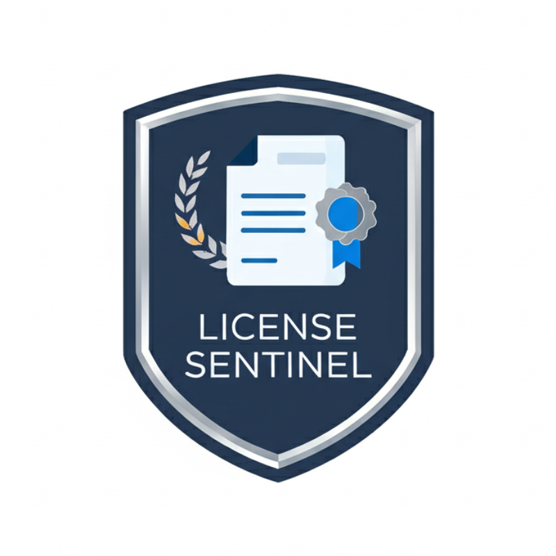

<div align="center">
  
</div>

<div align="center">
  <h1> License Sentinel 🛡️</h1>
</div>

**Your Project’s Automated Open Source License Guardian for VS Code**

LicenseSentinel empowers development teams to manage, audit, and enforce open-source license policies directly within Visual Studio Code, eliminating manual overhead and legal surprises.

---

## 🚀 Overview

Open-source dependencies accelerate development but introduce licensing complexity and risks, such as:

* **License Incompatibility**: Conflicts between permissive and copyleft licenses
* **Unvetted Components**: Bundled dependencies with unknown or custom licenses
* **Compliance Overhead**: Manual auditing across manifests, CI pipelines, and documentation

**LicenseSentinel** seamlessly integrates into your workflow, providing continuous scanning, real-time alerts, and customizable policy enforcement so you can focus on building, not legal checklists.

---

## 🔍 Features

### 1. Real-Time Scanning and Inline Insights

* **On-Save Analysis**: Automatically scan dependency manifests (e.g., `package.json`, `pom.xml`) every time you save a file.
* **Inline Decorations**: License information appears directly in code editors, with colored badges for compliant, unknown, and non-compliant statuses.
* **Hover Details**: Detailed popups show full license text, version, repository link, and risk level.

### 2. Activity Bar Dashboard

* **Aggregated Overview**: Click the 🛡️ icon in the Activity Bar to open a dashboard summarizing:

  * Total dependencies scanned
  * Counts by status (✅ Compliant | ❓ Unknown | ❌ Non-Compliant)
  * Recent changes and newly introduced risks
* **Filtering & Search**: Filter by license type, status, or specific dependency names.

### 3. Configurable Policy Rules

* **Allowlist & Denylist**: Define arrays of approved or forbidden licenses in VS Code `settings.json`:

  ```json
  {
    "license-sentinel.allowedLicenses": ["MIT", "Apache-2.0", "BSD-3-Clause"],
    "license-sentinel.deniedLicenses": ["GPL-3.0", "AGPL-3.0"],
    "license-sentinel.cacheDurationHours": 24
  }
  ```
* **Severity Levels**: Assign custom severity (e.g., warning vs. error) per license for editor diagnostics.
* **Custom Overrides**: Per-project or per-folder rule sets for monorepos and multi-module repositories.


### 4. Multi-Language and Multi-Platform Support

| Language              | Manifest File    |     Status    |
| --------------------- | ---------------- | :-----------: |
| JavaScript/TypeScript | `package.json`   |  ✅ Supported  |
| Python                | `pyproject.toml` |  ✅ Supported  |
| PHP                   | `composer.json`  |  ✅ Supported  |
| Java                  | `pom.xml`        |  ✅ Supported  |
| Go                    | `go.mod`         |  ✅ Supported  |
| Rust                  | `Cargo.toml`     |  ✅ Supported  |
| Ruby                  | `Gemfile.lock`   | ⏳ Coming Soon |
| .NET (C#)             | `*.csproj`       | ⏳ Coming Soon |

---

## 🛠️ Installation & Setup

1. **Install from Marketplace**

   * Open VS Code, go to Extensions (`Ctrl+Shift+X`), search for **LicenseSentinel**, and click **Install**.

2. **Configure Settings**

   * Open your user or workspace `settings.json` and add your policy rules (see Configurable Policy Rules).

3. **Initial Scan**

   * Trigger a manual scan via the command palette (`Ctrl+Shift+P` → `LicenseSentinel: Scan Dependencies`).

4. **Review & Resolve**

   * Check diagnostics in the Problems panel and hover over inline badges to review license details.

---


---

## 🤝 Contributing

We welcome all contributions—from bug reports and feature requests to pull requests and documentation improvements.

1. Fork this repository.
2. Create a feature branch (`git checkout -b feature/YourFeature`).
3. Commit your changes (`git commit -m 'Add YourFeature'`).
4. Push to the branch (`git push origin feature/YourFeature`).
5. Open a Pull Request.

Please follow the [Contributor Guidelines](CONTRIBUTING.md) and ensure all new code is covered by unit tests.

---

## 📄 License

```

MIT License

Copyright (c) 2025 Thirawat Sinlapasomsak

Permission is hereby granted, free of charge, to any person obtaining a copy
of this software and associated documentation files (the "Software"), to deal
in the Software without restriction, including without limitation the rights
to use, copy, modify, merge, publish, distribute, sublicense, and/or sell
copies of the Software, and to permit persons to whom the Software is
furnished to do so, subject to the following conditions:

The above copyright notice and this permission notice shall be included in all
copies or substantial portions of the Software.

THE SOFTWARE IS PROVIDED "AS IS", WITHOUT WARRANTY OF ANY KIND, EXPRESS OR
IMPLIED, INCLUDING BUT NOT LIMITED TO THE WARRANTIES OF MERCHANTABILITY,
FITNESS FOR A PARTICULAR PURPOSE AND NONINFRINGEMENT. IN NO EVENT SHALL THE
AUTHORS OR COPYRIGHT HOLDERS BE LIABLE FOR ANY CLAIM, DAMAGES OR OTHER
LIABILITY, WHETHER IN AN ACTION OF CONTRACT, TORT OR OTHERWISE, ARISING FROM,
OUT OF OR IN CONNECTION WITH THE SOFTWARE OR THE USE OR OTHER DEALINGS IN THE
SOFTWARE.

```